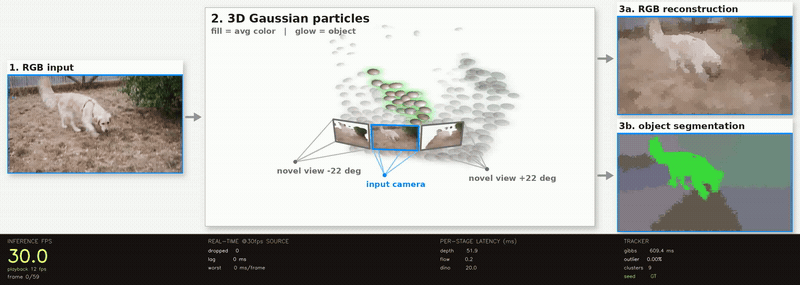
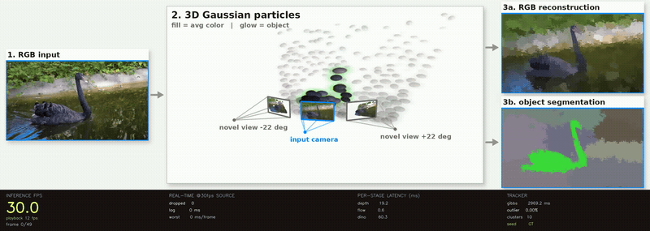

# StreamingVision

**Real-time Gaussian-particle tracking from a streaming video.** Each frame is
turned into metric depth (Depth-Anything V2), optical flow (SEA-RAFT), and DINOv2
features, which drive a **GenMatter++ Gibbs tracker** that maintains a persistent
cloud of 3-D Gaussian "particles" stuck to the scene. The visualization draws the
tracker's **actual** latent state — the real blob means/covariances and cluster
assignments — so it never diverges from what the model believes.

> The real-time version of **[GenMatter](https://github.com/esli999/GenMatter)** — bringing its
> motion tracking and segmentation to live video.




*The unified pipeline figure: **RGB input → 3-D Gaussian particles** (shown from the
real input camera plus two novel views) **→ RGB reconstruction + object segmentation**,
with live per-stage inference timing. Every particle is a Gaussian the tracker is
actually maintaining.*

## Quickstart

One-time: create the env and clone the optical-flow code (details in
[Setup](#setup)). Model weights download from Hugging Face on first use; the first
run also pays a ~30–90 s JIT + K-means warm-up.

```bash
# 1. Render the particle figure on the bundled sample video (no dataset needed):
RENDER_MODE=focused DEMO_NUM_BLOBS=256 \
  scripts/render_particles_demo.sh --source assets/test.mp4 --target-duration 0
#    -> runs/calibrate_consistency/viz_gaussian/test_unified.mp4

# 2. Run the live, multi-threaded streaming demo (real-time perception overlay):
python render_demo.py --source assets/test.mp4 --duration 10
#    -> assets/streaming_demo.mp4

# 3. The featured figures on DAVIS (after fetching the dataset, see Setup):
RENDER_MODE=focused scripts/render_particles_demo.sh --videos dog blackswan
```

`--source` accepts any mp4/mov or RGB-frames directory and seeds frame 0 with
k-means (no ground-truth or SAM masks required). `--videos` renders named DAVIS /
custom clips; the sentinels `all-davis` / `all-custom` / `all` enumerate every test
video from disk. See [`docs/RENDER_PARTICLES.md`](docs/RENDER_PARTICLES.md) for the
figure layout, every CLI flag, and the render-only tuning knobs.

## How it works

```
                 ┌─► Depth-Anything V2 ─► metric depth ──┐
   video frame ──┼─► SEA-RAFT ──────────► optical flow ──┼─► unproject ─► 3-D points
                 └─► DINOv2-S ──────────► dense features ─┘   (+ velocities, features)
                                                                      │
   annotated MP4 ◄── render (genmatter_viz) ◄── blob / hyperblob ◄────┘
                                                Gaussian particles
                                          GenMatter++ Gibbs tracker (genmatter_rt)
```

One Gibbs sweep runs per incoming frame, so blob/hyperblob (particle/cluster) state
persists and tracks across the clip. The tracker and renderer are cleanly separated —
tuning or swapping the visualization can never change tracking results.

| File | Role |
|------|------|
| `genmatter_rt.py` | the streaming **tracker** — perception → `init_state` / `step_multi_sweep` → particle state |
| `genmatter_viz.py` | the **renderer** — draws the tracker's real Gaussians; one-directional dep on the tracker |
| `render_demo.py` | the **live demo** — multi-threaded real-time pipeline → annotated MP4 |
| `scripts/render_gaussian_demo.py` | the **particle figure** renderer (the hero output above) |
| `scripts/tokencut.py` | self-supervised TokenCut frame-0 seed augmentation (offline) |
| `genmatterpp/` | vendored GenMatter++ JAX inference core (see `genmatterpp/VENDORED.md`) |

The live demo runs 9 threads (1 frame source, 5 perception/fusion workers, 3 viz
threads) communicating through latest-value slots with a `threading.Semaphore(1)`
serializing GPU submissions. Measured on an RTX 5090 at 360p:

| stream | latency (ms) | staleness (frames) |
|--------|--------------|--------------------|
| depth  | 9–28  | 0–1 |
| flow   | 16–31 | 1   |
| features | 9–32 | 0–1 |
| fusion | 15–32 | 1   |

~40 % avg / 57 % peak GPU, ~2.3 GB VRAM (no leak over a 60 s soak), ~180 W.

## Setup

**Hardware:** built and tested on an NVIDIA RTX 5090 (sm_120, driver 580). CUDA
12.8+ is required for sm_120 (earlier toolkits crash with "no kernel image is
available for execution on the device").

**Environment** (conda, Python 3.11):

```bash
conda create -n streamingvision python=3.11 -y
conda activate streamingvision
pip install --upgrade pip
pip install -r requirements.txt
```

Verify the GPU stack before anything else (XLA env vars **must** be set before
`import jax` — the backend is initialized at first import):

```bash
python -c "
import os; os.environ['XLA_PYTHON_CLIENT_PREALLOCATE']='false'; os.environ['XLA_PYTHON_CLIENT_MEM_FRACTION']='0.25'
import torch, jax
print(torch.__version__, torch.cuda.get_device_capability(), jax.devices())
"
```

**Optical-flow code** (SEA-RAFT, imported at runtime; weights pull from HF):

```bash
git clone --depth 1 https://github.com/princeton-vl/SEA-RAFT.git third_party/SEA-RAFT
```

**Videos.** `assets/test.mp4` ships with the repo, so the Quickstart runs as-is. To
use your own clip, transcode it to H.264 (`ffmpeg -i mine.mov -c:v libx264 -pix_fmt
yuv420p -an assets/test.mp4`). To render the featured DAVIS figures, fetch the
TAP-Vid DAVIS clips into `assets/tapvid_davis_30_videos_processed/` (driver:
`genmatterpp/scripts/download_tapvid_davis.sh`). The Depth-Anything, SEA-RAFT,
and DINOv2 checkpoints download from Hugging Face on first use (cached under
`~/.cache/huggingface/`).

## Migrating to a webcam

`render_demo.py`'s `FrameSource` already accepts an integer camera index
(`isinstance(src, int)`, `0` = first USB camera) in addition to a file path, so
pointing the live demo at a webcam is a one-value change — no other code changes.

---

*Status: this is the real-time perception + tracking substrate; a fuller JAX
inference model slots into the reserved worker in a later milestone.*
